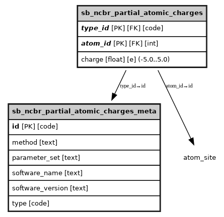

# Dictionary overview

Current version of the schema is available at [https://sb-ncbr.github.io/charges-schema/schemas/mmcif_charges_v11.dic](https://sb-ncbr.github.io/charges-schema/schemas/mmcif_charges_v11.dic).



See the [full version](images/schema_full.png) with the descriptions.

## Charge-set metadata in 1.1

Version 1.1 keeps the partial-charge rows unchanged and adds provenance to `_sb_ncbr_partial_atomic_charges_meta`:
the method identifier, optional parameter-set identifier, and the producing software name and version.
`method` identifies the method alone; `parameter_set` is `.` when no parameter set applies.

```text
loop_
_sb_ncbr_partial_atomic_charges_meta.id
_sb_ncbr_partial_atomic_charges_meta.type
_sb_ncbr_partial_atomic_charges_meta.method
_sb_ncbr_partial_atomic_charges_meta.parameter_set
_sb_ncbr_partial_atomic_charges_meta.software_name
_sb_ncbr_partial_atomic_charges_meta.software_version
1 empirical qeq QEq_original ChargeFW 0.0.1
```

# Updating dictionary

After updating the dictionary, check whether the file is valid:

```bash
gemmi validate -v schemas/mmcif_charges_v11.dic
```

# Information to set in mmCIF
```
loop_
_audit_conform.dict_name
_audit_conform.dict_version
_audit_conform.dict_location
mmcif_charges_v11.dic       1.1      https://sb-ncbr.github.io/charges-schema/schemas/mmcif_charges_v11.dic
```

# Checking the mmCIF

For a full check, you will usually need to download the [official pdbx dict](https://mmcif.wwpdb.org/dictionaries/ascii/mmcif_pdbx_v50.dic). Then do:

```bash
gemmi validate -v -d mmcif_pdbx_v50.dic -d schemas/mmcif_charges_v11.dic structure.cif
```
